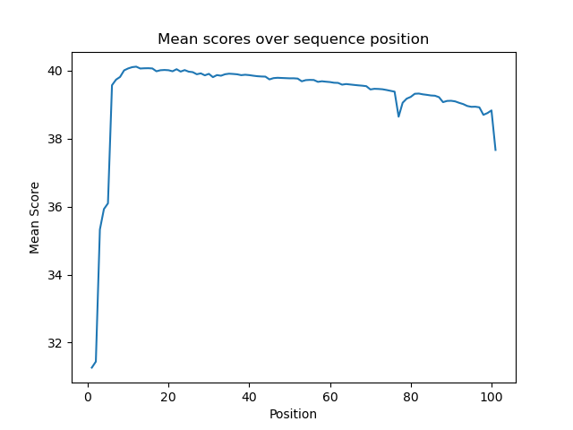
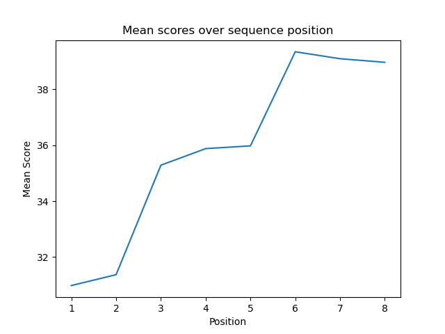
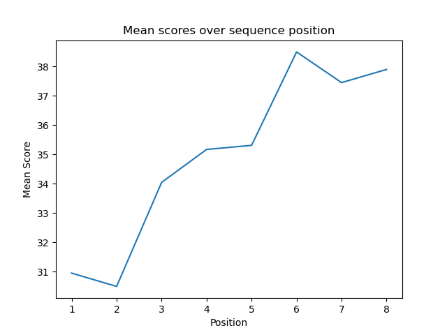
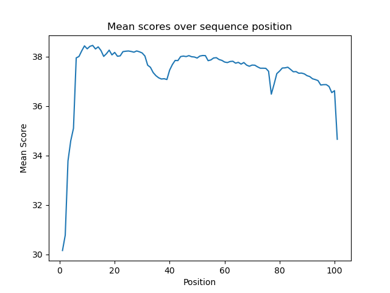

# Assignment the First

## Part 1
1. Be sure to upload your Python script.

| File name | label | Read length | Phred encoding |
|---|---|---|---|
| 1294_S1_L008_R1_001.fastq.gz | Bio1  | 101 | Phred+33 |
| 1294_S1_L008_R2_001.fastq.gz | Index1 | 8 | Phred+33 |
| 1294_S1_L008_R3_001.fastq.gz | Index2 | 8 | Phred+33 |
| 1294_S1_L008_R4_001.fastq.gz | Bio2 | 101 | Phred+33 |
```
zcat (file) | head -8   # for each file
zcat (file) | head -2 | tail -1 | wc 
```


2. Per-base NT distribution








   3. For R1, the reads were good so 38 seems like a good cutoff. For R2, the quality is a bit lower but still in the high 30's, so 38 seems fair again. For index 1 and index 2, they increase over time and are all over 30. I would say 30 is a cutoff and could potentially use all of the index data. 
    
   4. zcat "/projects/bgmp/shared/2017_sequencing/1294_S1_L008_R2_001.fastq.gz" | sed -n '/^@/{n;p;}' | awk '/N/ {count++} END{print count}'
R2: 3976613
R3: 3328051
Total: 7304664
    
## Part 2
1. Define the problem
2. Describe output
3. Upload your [4 input FASTQ files](../TEST-input_FASTQ) and your [>=6 expected output FASTQ files](../TEST-output_FASTQ).
4. Pseudocode
5. High level functions. For each function, be sure to include:
    1. Description/doc string
    2. Function headers (name and parameters)
    3. Test examples for individual functions
    4. Return statement
